# DART 測定方法
>最終更新：2026-07-02  
> 最終編集者：渡邉

> 参照：JEOL 日本電子株式会社　|　msAxel@LP4G-DART Ver. 1.0_201706

---

## 目次

- [1. 測定準備](#1-測定準備)
- [2. 実測定](#2-実測定)
- [3. DART-SVP イオン源の取り付け](#3-dart-svp-イオン源の取り付け)
- [付録](#付録)
  - [1) DART（Direct Analysis in Real Time）イオン化について](#1-dartdirect-analysis-in-real-timeイオン化について)
  - [2) ヒーター温度とガス温度の関係図（目安）](#2-ヒーター温度とガス温度の関係図目安)
 

---

<a href="https://drive.google.com/file/d/1cWaNMhVzkx0fVZp-0E_cbd6NF3NpALom/view?usp=drive_link" target="_blank" rel="noopener">DART装着動画</a>

## 1. 測定準備

① He ガス、N2 ガスの元栓を開く。

② フロントパネルに取り付けてある DART-SVP イオン源電源ユニットの主電源を ON にする。

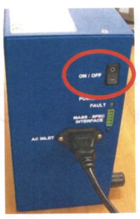

③ "Microsoft Edge" を開き、DART-SVP ソフトウェアを起動する。

　※アドレス：`http://192.168.10.100`

　"Free Run" 画面に切り換える。

<!-- 画像: Microsoft Edge起動アイコンとアドレスバー、Free Run画面 -->
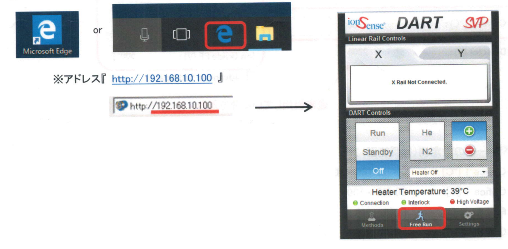

④ "Free Run" 画面の **Standby** ボタンをクリックすると、自動的に **N2** ガスボタンが ON になる。イオンの極性、ヒーター温度を選択する。

　※ Standby でヒーター温度を設定している時もガスは流れる。
 
　※ 選択部分が青色になる。
 
 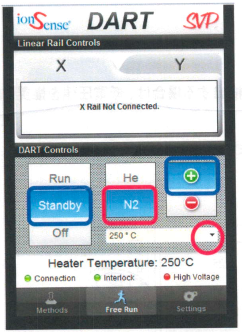

⑤ msAxel を起動し、「MS ウインドウ」を開く。プロジェクトを新規作成するか、既存のプロジェクトを開く。

　※メニューバー：`[File]-[New Project]`、または `[File]-[Open Project]`

---

⑥ メニューバー `[Load Method]-[MS Method]` を選択し、DART 用 MS メソッドを開く。

　※ DART 用の MS メソッドが保存されていない場合は、ESI 用調整条件を開いてからイオン化モードを DART に変更する。

⑦ <del>隔離弁を開く。</del>中大では隔離弁を触らないため、スキップ。

　※ 測定等を行わないときは、隔離弁を閉じておくことを推奨する。

⑧ 装置モードを `[Operate]` にする。

⑨ "Free Run" 画面の **Run** ボタンをクリックし、He ガスボタンが ON になることを確認する。スペクトルモニタでバックグラウンドのイオンが検出されることを確認する。（例：*m/z* 59　アセトンの [M+H]⁺）

⑩ 必要に応じて、Tune 条件を編集する。「MS」ウインドウの 'Tune' タブを選択する。

<!-- 画像: Tune / Acquisition タブの設定画面 -->
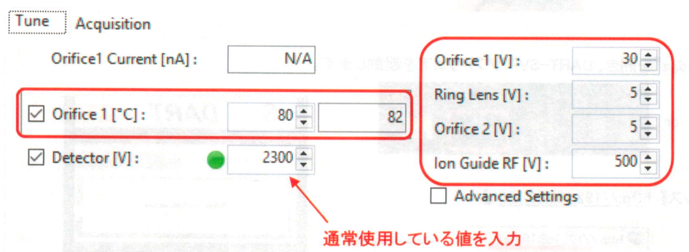

**＜各パラメータの設定例（推奨範囲）＞** 基本そのままでOK by編集者

| パラメータ | 推奨値 | 推奨範囲 |
|---|---|---|
| Orifice 1 [°C] | 80 | 60〜100 |
| Orifice 1 [V] | 30 | 10〜100 |
| Ring Lens [V] | 5 | 5〜10 |
| Orifice 2 [V] | 5 | 5〜10 |
| Ion Guide RF [V] | 500 | 100〜1000（低 *m/z* 値のイオンを検出する場合は、低電圧値を推奨する） |

⑪ `[Acquisition]` タブを選択し、マススペクトル取得条件の設定を行う。

<!-- 画像: Acquisitionタブ設定画面 -->
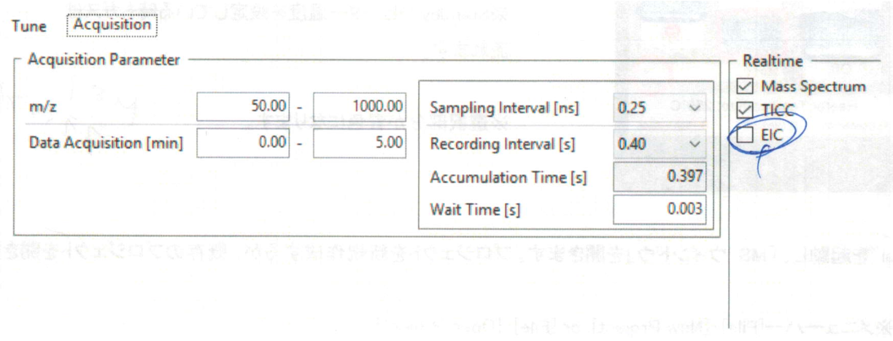

**＜各パラメータの設定例（推奨範囲）＞** m/z以外は基本そのままでOK by編集者

| パラメータ | 設定内容 |
|---|---|
| *m/z* | 測定対象成分に応じて、任意の範囲を設定する |
| Data Acquisition [min] | 終了時間を 2〜10 min に設定する |
| Recording interval [s] | 0.4 s（0.1〜0.5 s） |

⑫ 'Tune' タブ、'Acquisition' タブの設定終了後、`[Save Method As]-[MS Method]` を選択し、任意の名前で保存する。

　※ He ガスの消費を抑えるため、チューニング終了後は DART-SVP の "Free Run" 画面で **Standby** に切り換えておく。この時、ガスが **N2** になっていることを確認すること。

---

## 2. 実測定

① "Free Run" 画面の **Run** ボタンをクリックして He ガスを流し、ピークを確認する。

② 必要な場合は、DART イオン源とオリフィスとの距離を調整する。

　DART イオン源 SVP 先端とオリフィス 1 の距離を、測定試料の大きさに合わせて調節する。

<!-- 画像: DARTイオン源SVP先端とオリフィス1の距離調整（側面図・スライド機構固定ネジ） -->
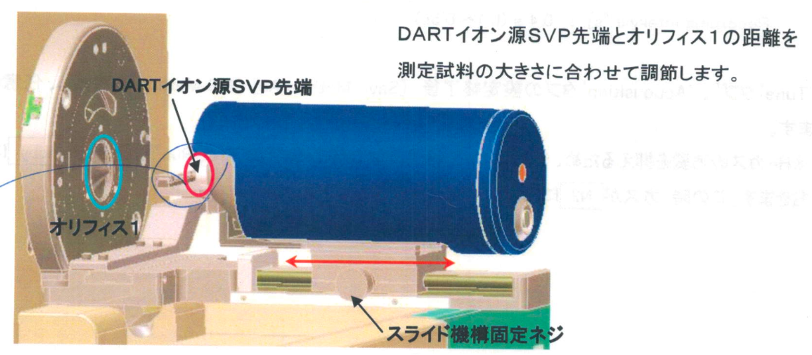

　左右のスライド機構固定ネジを緩め、距離を調節する。ガラス棒での測定では、1〜2 cm が目安となる。

　調節後は必ず左右のスライド機構固定ネジを締めること。

③ DART イオン源のイオン生成位置に試料を導入する。

**注意！白いセラミック部分にサンプルをつけないように！数万円の部品です**

<!-- 画像: DARTイオン源SVP先端とオリフィス1（正面図・試料導入位置） -->
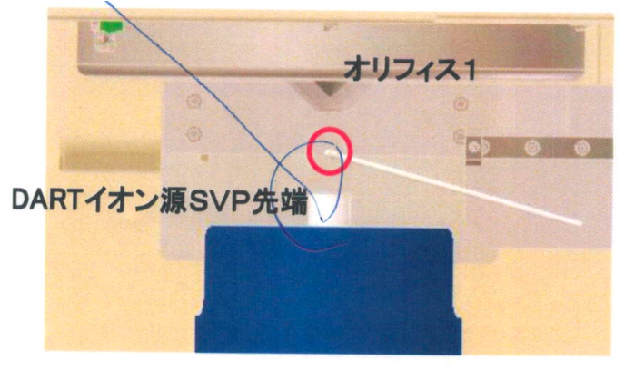

　※ 液体試料の場合、ガラス棒の先端に試料を塗布し、これを導入する。

　　粉末試料の場合、ガラス管（毛細管）に少量詰めて導入するか、もしくはセラミックシートなどに包んで導入する。

④ 液体試料などの場合は、データ取得前にスペクトルモニタでピークの確認を行う。

| ピークの状態 | 対応 |
|---|---|
| ピークが確認できた場合 | シングル分析でデータ取得を行う |
| ピークが確認できない場合 | 通常は DART ヒーター温度の設定値を高くする |

　※ DART 測定における最重要パラメータはヒーター温度の設定値である。設定温度が高い方が検出しやすくなる傾向があるが、高すぎると熱分解の原因となるため、注意が必要である。

---

⑤ シングル分析を開始する。

　「MS」ウインドウ右下の **Single Run** ボタンをクリックする。

　「Single Acquisition」ダイアログに必要な情報を入力する。

<!-- 画像: Single Analysisダイアログ -->
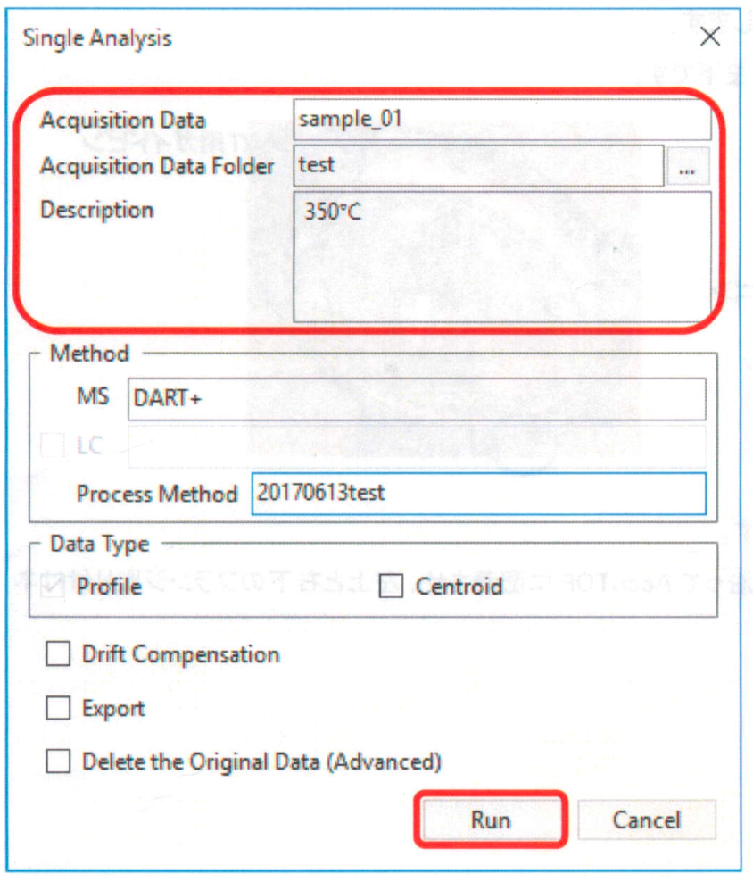

| 項目 | 内容 |
|---|---|
| Acquisition Data | 任意の測定データファイル名を入力する |
| Acquisition Data Folder | Acquisition Data を保存するフォルダーを指定する（任意に新規作成可） |
| Coment | ヒーター温度、試料情報などのコメントを入力する |

　すべての入力が終了後、**Run** をクリックする。

　測定の準備が完了すると以下が表示されるので、"**Go**" をクリックし、データの取得を開始する。

<!-- 画像: Start Runダイアログ（Go / Stopボタン） -->
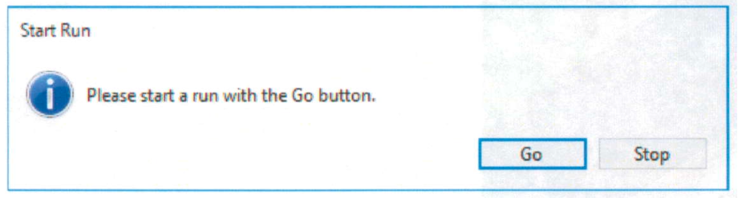

　☆ データ処理方法は、ESI と同じである。ESI の資料を参照すること。

**※ 連続して測定を行わない場合…**

DART-SVP の "Free Run" 画面で **Standby** に切り換える。この時、ガスが **N2** になっていることを確認すること。

**※ 測定を終了する場合…**

"Free Run" 画面で **Off** に切り替える。自動的に Heater Off になり、ヒーター温度が 200℃以下になるまで N2 ガスが流れる。実温度が 200℃以下になり、N2 ガスが OFF になったことを確認後、DART-SVP ソフトウェアを閉じる。

---

## 3. DART-SVP イオン源の取り付け

DART-SVP イオン源を取り付け、取り外しのときは、必ず DART 電源ユニットのスイッチをオフにする。

① DART-SVP イオン源用の短いガイドピンに交換する。

　※ DART-SVP イオン源のガイドピン位置は右上と左下である。

<!-- 画像: ガイドピン交換前後（通常ガイドピン → DART用ガイドピン） -->
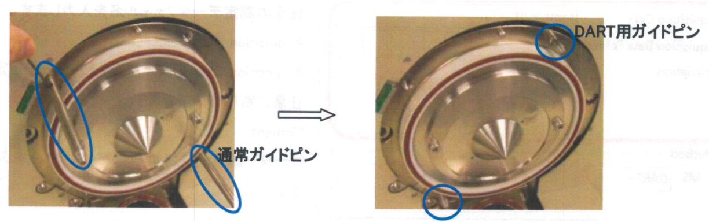

② DART-SVP イオン源を AccuTOF に取り付ける。

　※ DART-SVP イオン源のフランジをガイドピンに沿って AccuTOF に密着させ、左上と右下のフランジ取り付けネジを 5 mm の六角レンチで締める。

<!-- 画像: DART-SVPイオン源のAccuTOF取り付け（ガイドピン・取り付けネジ位置） -->
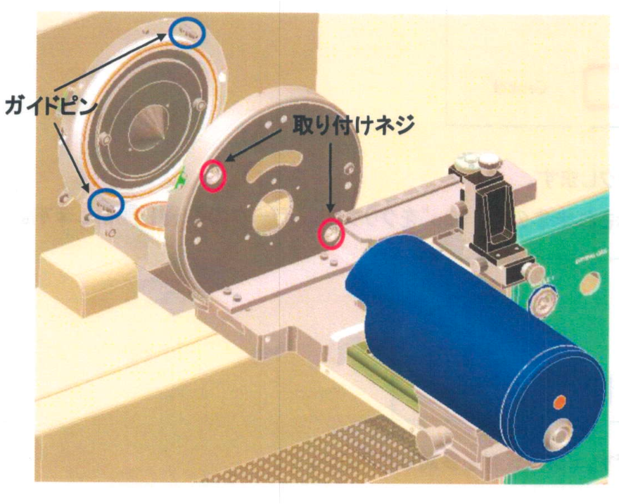

③ DART-SVP イオン源にガスライン、高電圧ケーブルを接続する。

---

## 付録

### 1) DART（Direct Analysis in Real Time）イオン化について

<!-- 画像: DARTイオン源構成図（Needle, Heater, He Gas, Ring Lens, Orifice1/2, Ion Guide, Analyzer） -->
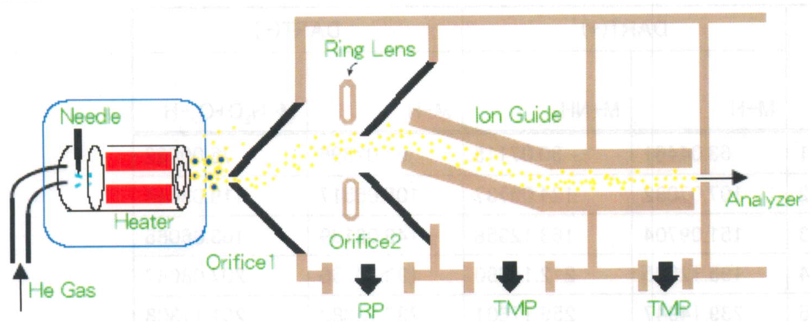

DART イオン源は、He ガス（または窒素ガス）をグロー放電によりプラズマ化したときに生成する準安定な励起状態の He* だけを大気中に放出し、He* と大気中の水分子や酸素分子などとの反応を介して、最終的にサンプルをイオン化する。放電によりプラズマから発生する荷電粒子は、2 つの同心円状電極で除去される。サンプルの気化または熱脱離を促進するため、ヒーターにより He ガスを 550℃まで加熱することができる。

DART には下記の特徴がある。

- 気体、液体、固体などのさまざまな形態のサンプルを大気圧下、接地電位で迅速に直接分析できる。
- ふき取りや抽出といった前処理が不要である。
- ソフトなイオン化で単純なマススペクトルが得られる。
  - 正イオンモードでは [M+H]⁺ が、負イオンモードでは [M-H]⁻ が生成されやすい。
  - [M+Na]⁺ などのアルカリ金属イオン付加分子は生成しない。

バックグラウンドに水クラスターイオンが検出される。

**水クラスターイオン（*m/z* 37 [(H₂O)₂+H]⁺、55 [(H₂O)₃+H]⁺）の確認方法**

| 条件 | 設定例 |
|---|---|
| DART 条件 | 極性：+、ガス：He、ヒーター温度：OFF |
| MS 条件 | Orifice 1：10 V、Ring Lens：5 V、Orifice 2：5 V、Ion Guide RF：100 V |

　※ 他のバックグラウンドイオンの影響で、強度が低い場合がある。

### 2) ヒーター温度とガス温度の関係図（目安）

<!-- 画像: ヒーター温度とガス温度の関係グラフ（Heガス温度／N2ガス温度） -->
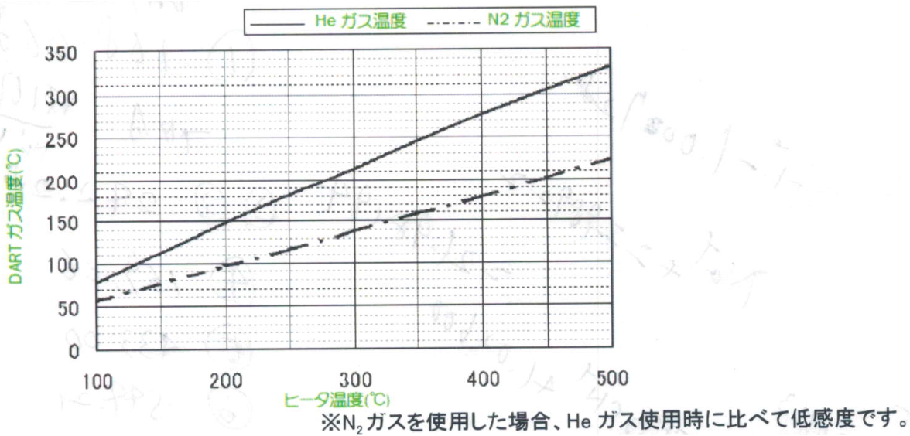

　※ N2 ガスを使用した場合、He ガス使用時に比べて低感度である。
 
---
