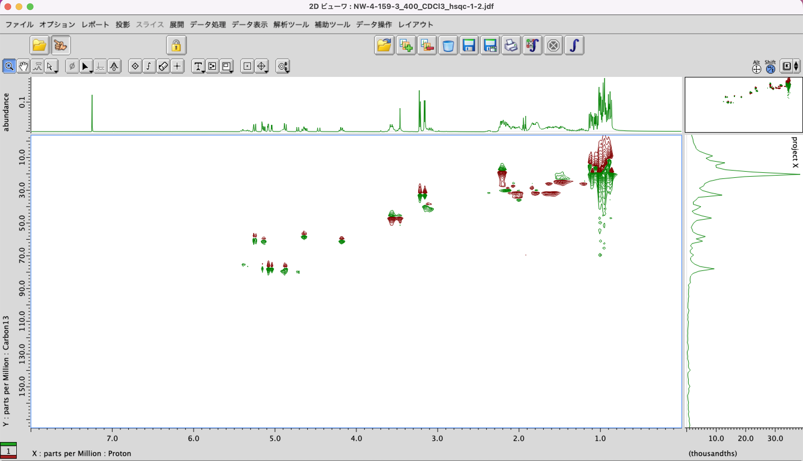
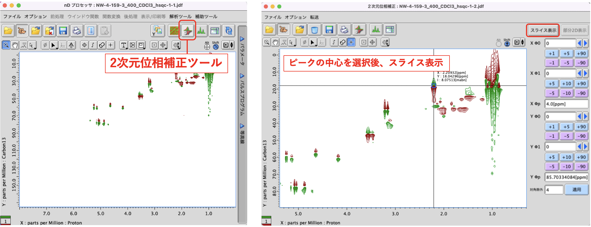
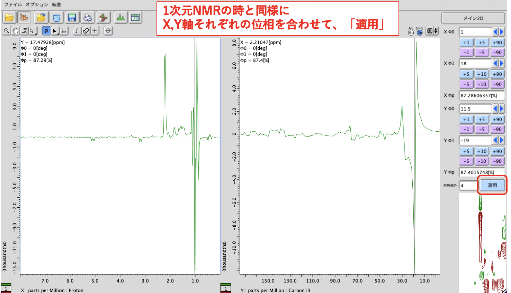

# 2次元NMR (COSY,HMQC,HSQC,HMBC,NOESY,ROESY,TOCSY) 測定方法

> 最終更新 : 2026-08-06
> 最終編集者 : 渡邉

**パルスシーケンスの中身は公にはいじってはいけないことになっている。**    
まずプロトンを測定し、SIMが合っているかを確認する。 
パルスシーケンス -> 2d -> 測定したいNMRを選んでダブルクリック 
### Header
auto gain にチェック (recvr gain に値を入れるならチェックしない）、force tune にチェック（最初だけ）  
### Instrument
auto gain にチェックを入れないなら、 Gain Value Established の値を入れる。こっちの方が早い。　 
### Acquisition (ex.0~7ppmを測定したい時)
x_offset 測定したい範囲の中央値 (3.5)  
x_sweep 測定したい範囲の値 (7)  
offset, sweepをセットした後に nus を入れる。
**(NOESY,ROESY,TOCSYは nus を入れてはいけない。)**
パラメーター追加 -> y_nuslist -> パラメータ追加 -> 完了 -> 追加された y_nuslist をクリック -> (warning みたいなのが出てきたら、閉じるを押す) 
-> schedule -> 完了 
scan で測定時間をいじる。何の倍数にすればいいかは scans にカーソルを持っていけばわかる。　 
測定開始　 　 
## ポイント : 同時に複数の2次元NMR をとる場合 
x軸プロトン/y軸カーボン(HMBCやHMQCなど)は続けて測定するとよい（force tune を最初だけに入れれば良いため、時間が削減できる）。 
ex) COSY, HMQC, HMBC を1終夜で測定したい時 
1H -> HMQC -> HMBC -> COSY の順で測定すると良い。（force tuneは HMQC だけに入れる）

測定開始　 　 
## Tips：2DNMRの位相の合わせ方 

例：位相の合っていないHSQC

① 生データを開き、「2次元位相補正ツール」を開く

② ピークの中心を選択後、「スライス表示」を押す

③ 1次元NMRの時と同様の方法で、X,Y軸それぞれの位相を合わせてから、「適用」

 
　※ 参照：[JASON Tips: 位相補正と化学シフト補正](https://www.jeol.co.jp/solutions/applications/details/NMJT_0004.html)
